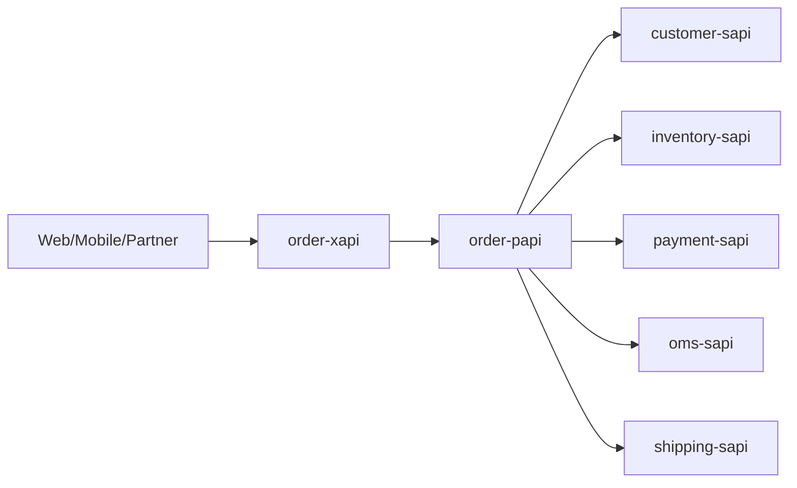

# OMS Mule Portfolio - HLD and LLD

## 1) High-Level Design (HLD)

### 1.1 API-Led Topology

- Experience Layer: `order-xapi`
- Process Layer: `order-papi`
- System Layer: `customer-sapi`, `inventory-sapi`, `payment-sapi`, `oms-sapi`, `shipping-sapi`

### 1.2 End-to-End Order Creation Flow

1. Client invokes `order-xapi` create order.
2. `order-xapi` delegates orchestration to `order-papi`.
3. `order-papi` validates customer and inventory.
4. `order-papi` authorizes payment.
5. `order-papi` creates OMS order and shipment.
6. Consolidated response returned to client.

## 2) Low-Level Design (LLD)

### 2.1 Service Responsibilities

- `customer-sapi`: `/customers/{customerId}/validate`, `/customers/{customerId}`
- `inventory-sapi`: `/inventory/validate`
- `payment-sapi`: `/payments/authorize`, `/payments/{transactionId}/capture`, `/payments/{transactionId}/reverse`
- `oms-sapi`: `/orders`, `/orders/{orderId}`, `/orders/{orderId}/status`
- `shipping-sapi`: `/shipments`, `/shipments/{shipmentId}`, `/shipments/{shipmentId}/cancel`
- `order-papi`: process orchestration APIs for orders
- `order-xapi`: consumer contract for order operations

### 2.2 Error Handling Pattern

- APIKit/router-level routing.
- Systematic HTTP status handling:
  - `400` validation errors
  - `401` auth failures
  - `402` payment failures (where relevant)
  - `404` not found
  - `409` business conflicts
  - `500` internal errors

### 2.3 Deployment Pattern

- Each project has Mule Maven deployment profile `cloudhub-dev`.
- CloudHub 2.0 target and connected-app credentials resolved by properties.
