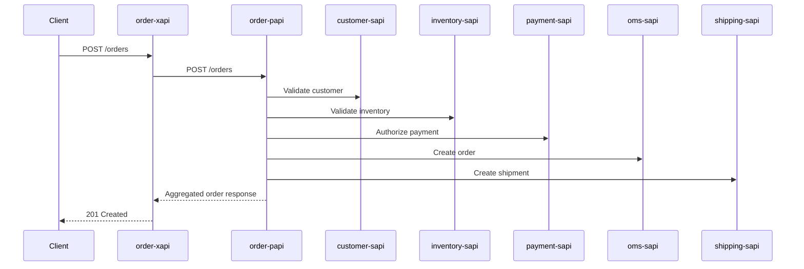

# OMS Mule Portfolio - Project Lifecycle and Workflows

## 1) Delivery Lifecycle

1. **Design**
   - RAML contracts for all 7 APIs.
   - Traits/types organized per API.
2. **Build**
   - Mule Maven packaging per project.
   - APIKit-led flow implementation.
3. **Deploy**
   - CloudHub 2.0 deployment via project profiles (`cloudhub-dev`).
4. **Govern**
   - Design Center sync, Exchange publication, API Manager governance.
5. **Operate**
   - Runtime validation, logs, and regression checks.

## 2) Cross-API Workflow (Order Processing)

## 3) Implementation Notes

- Security uses Basic Authentication across contracts.
- `order-xapi` exposes consumer-facing contract.
- `order-papi` encapsulates orchestration and system dependency management.
- System APIs are focused and isolated by domain.

## 4) Current Consolidation Scope

- Repository consolidation completed for all 7 OMS APIs.
- Documentation and scoring pack aligned to airline-project style.
- Deployment and runtime proof should be captured per environment during execution windows.
